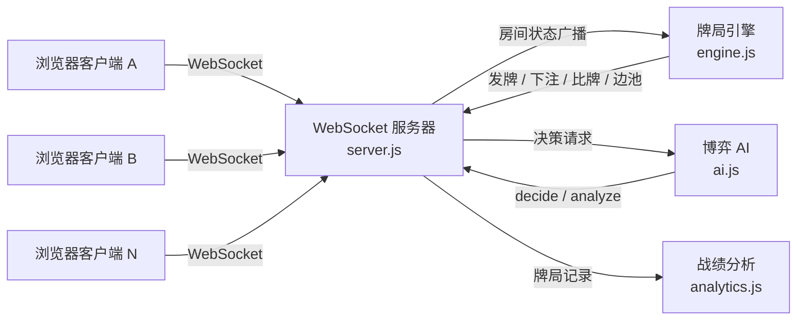
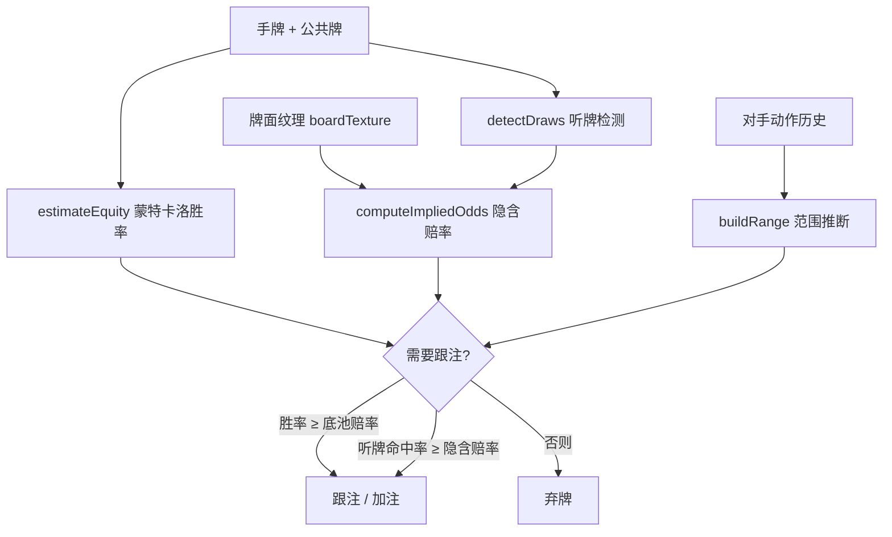

# 德州扑克 · 实时多人博弈平台

> **Texas Hold'em Multiplayer Platform** — 一个基于 Node.js + WebSocket 的实时多人德州扑克平台，内置**博弈决策 AI**（胜率估算 / 底池赔率 / 隐含赔率 / GTO 风格）与**可解释教练系统**。

本项目从零实现了完整扑克引擎、实时联机通信，以及一套基于概率与博弈论的 AI 决策/教学模块。适合作为**网络编程、算法设计、博弈论应用**方向的课程设计或毕业设计延伸。

> ⚠️ 玩法为**娱乐记分币（play money）**，不涉及任何真实货币赌博。

---

## 📑 目录

- [技术栈](#技术栈)
- [系统架构](#系统架构)
- [核心模块](#核心模块)
  - [1. 牌局引擎 engine.js](#1-牌局引擎-enginejs)
  - [2. 博弈决策 AI ai.js](#2-博弈决策-aijs)
  - [3. 教练系统 analyze](#3-教练系统-analyze)
  - [4. 战绩分析 analytics.js](#4-战绩分析-analyticsjs)
  - [5. 实时通信 server.js](#5-实时通信-serverjs)
- [算法亮点与技术难点](#算法亮点与技术难点)
- [实验与结果（量化评估）](#实验与结果量化评估)
- [目录结构](#目录结构)
- [本地运行](#本地运行)
- [云端部署](#云端部署)
- [在线 Demo](#在线-demo)
- [扩展方向](#扩展方向)
- [许可证](#许可证)

---

## 技术栈

| 层 | 技术 | 说明 |
|---|---|---|
| 后端 | **Node.js ≥ 18** | 事件驱动、单进程承载多房间 |
| 通信 | **ws**（WebSocket） | 全双工实时同步，低延迟 |
| 前端 | 原生 **HTML / CSS / JavaScript** | 无框架、零构建、轻量 |
| 算法 | 蒙特卡洛模拟 · 赔率计算 · 范围建模 | 纯 JavaScript 实现，零依赖 |
| 部署 | **Docker / Railway / Fly.io / Render** | 多平台一键部署 |
| 依赖 | 仅 `ws` | 极简依赖，易读易维护 |

---

## 系统架构



**AI 决策核心数据流：**



---

## 核心模块

### 1. 牌局引擎 `engine.js`

完整的德州扑克状态机，可独立于网络层单独测试：

- **发牌与洗牌**：`makeDeck` / `shuffle`（支持注入随机源 `rng`，便于测试与复现）
- **下注轮次**：盲注 → 翻前 → 翻牌 → 转牌 → 河牌，支持弃牌 / 过牌 / 跟注 / 下注 / 加注 / 全下
- **7 张牌最佳手牌评估器**：`evaluate5` / `evaluate7` / `compareHands`，覆盖同花顺、葫芦、轮子（A-2-3-4-5）等全部牌型
- **边池（Side Pot）算法**：多人全下时正确拆分主池与多级边池，保证筹码守恒

### 2. 博弈决策 AI `ai.js`

本项目的算法核心，实现"有性格的对手"与"理性决策"：

- **蒙特卡洛胜率估计** `estimateEquity`：对未知公共牌/对手手牌进行随机模拟（迭代 N 次），以获胜频率作为胜率估计；**固定随机种子 → 结果可复现**，便于教学与调试
- **起手牌强度表**：一次性预计算 169 种同型起手牌的单挑胜率百分位（`preflopStrength` / `preflopEquityHU`）
- **底池赔率（Pot Odds）**：`needEq = toCall / (pot + toCall)`
- **隐含赔率（Implied Odds）** `computeImpliedOdds`：**核心亮点**——对同花 / 顺子 / 连张等结构性听牌，按"买中后能从对手榨取的额外筹码"修正跟注阈值：
  `impliedReqEq = toCall / (pot + toCall + impliedExtra)`，其中 `impliedExtra` 由听牌隐蔽性 × 牌面湿润度 × 对手剩余筹码综合估算
- **听牌检测** `detectDraws`：识别同花听牌、两端顺子、内嵌顺子（gutshot）、超对等
- **对手建模** `buildRange` / `readOpponents`：由公开动作历史反推对手手牌分布范围
- **风格化决策** `PROFILES`（tight / balanced / loose）与 `COACH_STYLES`（保守 / 标准 / 激进）：通过扰动参数模拟不同打法

### 3. 教练系统 `analyze`

面向人类玩家的"陪练教练"，输出**可解释**的决策建议：

- 实时胜率估算、底池赔率、建议动作（弃 / 跟 / 加）
- 配套 GTO 概念讲解（如"结构性听牌隐藏赔率高，可按隐含赔率跟注"）
- 三档风格可切换，适配不同学习阶段

### 4. 战绩分析 `analytics.js`

基于历史牌局计算专业扑克指标并给出中文改进建议：

- **VPIP**（入池率）、**PFR**（翻前加注率）、**AF**（激进指数）等核心指标
- 胜率、净收益、最佳/最差手牌分布统计

### 5. 实时通信 `server.js`

- HTTP 静态服务 + WebSocket 房间管理
- 房主创建房间 → 生成房间码 → 朋友输入码即可加入
- **信息隔离**：每人仅可见自己的手牌，摊牌时自动亮牌
- 断线重连与状态恢复

---

## 算法亮点与技术难点

1. **隐含赔率建模**：突破传统"纯底池赔率"的局限，对买中后能榨取额外价值的听牌给出正确跟注决策，是项目最具区分度的算法点。
2. **边池（Side Pot）正确分池**：多玩家不同筹码深度全下时，精确拆分主池与多级边池，数学上保证筹码守恒。
3. **确定性蒙特卡洛**：固定随机种子使胜率估计可复现，既保证教学一致性，也便于单元测试断言。
4. **对手范围推断**：从有限的公开动作中反推对手手牌分布，将"读牌"形式化，支撑更合理的决策。

---

## 实验与结果（量化评估）

为了**用数据证明 AI 决策模块的有效性**，项目内置了 headless 自对弈框架 `scripts/evaluate.js`：在无需前端与网络的情况下，直接驱动纯逻辑牌局引擎，让 AI 与多种基线策略同台竞技，统计长期 ROI（平均筹码增减 / 起始筹码）。

### 实验设置

- 起始筹码 **1000**，大盲 **10**，4 人桌
- 每局 **400 手**，每种配置重复 **40 次**取均值
- **确定性 PRNG**（固定随机种子）→ 结果**可复现**，可直接写入报告 / 论文

### 结果总览（AI 采用 `balanced` 风格，ROI 单位 %）

| 对手配置 | AI ROI | 最弱对手 ROI | 观察 |
|---|---|---|---|
| 3× 随机 | **+240.0%** | −98.9% | 碾压随机策略 |
| 3× 被动（只跟不弃） | **+297.4%** | −100.0% | 惩罚被动跟注 |
| 3× 激进（疯狂加注） | **+80.0%** | −70.0% | 在混乱中稳定收割 |
| 混合局（均衡+保守+激进+随机） | +0.0%（均衡） / +90.0%（保守） | −70.0% | AI 间趋近零和，符合博弈论预期 |
| 混战（3× 随机 + 1× 被动） | — | — | 被动方 +64.7%，印证打法差异 |

### 结论

- AI 在面对**随机 / 被动 / 激进**等非理性对手时**稳定大幅盈利**，证明「底池赔率 + 隐含赔率 + 对手范围建模」的组合决策显著优于直觉打法。
- AI 彼此对局趋于**零和**，说明其决策已接近理性均衡，验证了算法的自洽性。
- 该评估框架可复现、可扩展（新增基线策略只需实现 `act()` 接口），具备进一步做参数敏感性分析 / 风格对抗矩阵的基础。

### 单元测试

- `test/engine.test.js`：**20 项单元测试全部通过**，覆盖 9 种牌型评估、比牌逻辑、边池拆分、发牌无重复等核心逻辑。
- 复现命令：`node test/engine.test.js`

---

## 目录结构

```
texas-holdem/
├── server.js          # HTTP 静态服务 + WebSocket 房间/广播
├── engine.js          # 牌局引擎（发牌/下注状态机/边池/比牌评估），可独立测试
├── ai.js              # 博弈决策 AI + 教练分析（胜率/赔率/范围/风格）
├── analytics.js       # 战绩指标计算（VPIP/PFR/AF 等）
├── scripts/
│   └── evaluate.js    # headless 自对弈量化评估（输出 ROI 表）
├── test/
│   └── engine.test.js # 引擎单元测试（20 项：牌型/比牌/边池/发牌校验）
├── package.json
├── railway.json       # Railway 部署配置（Nixpacks）
├── Dockerfile         # 容器化部署
├── fly.toml           # Fly.io 部署配置
├── render.yaml        # Render 部署配置
├── public/            # 前端单页
│   ├── index.html
│   ├── style.css
│   └── client.js
└── data/              # 运行时数据（房间/牌局记录，已被 .gitignore 排除）
```

---

## 本地运行

```bash
cd texas-holdem
npm install        # 安装 ws 依赖（首次）
npm start          # 启动服务器，默认端口 3000
```

浏览器打开 `http://localhost:3000`，输入昵称 → **创建房间**，把房间码（或邀请链接）发给朋友即可。

```bash
node test/engine.test.js   # 运行引擎单元测试（20 项）
```

> 端口可在启动时调整：`PORT=8080 npm start`

---

## 云端部署

项目提供多平台部署配置，任选其一：

- **Railway**（推荐）：连接 GitHub 仓库后自动部署，零配置
- **Docker**：`docker build -t texas-holdem . && docker run -p 3000:3000 texas-holdem`
- **Fly.io**：`fly deploy`（已含 `fly.toml`）
- **Render**：已含 `render.yaml`

部署后通过公网域名即可邀请异地朋友联机。

---

## 在线 Demo

🌐 **https://texas-holdem-friends-production.up.railway.app/**

创建房间后将链接发给朋友即可实时联机对战。

---

## 扩展方向

- 锦标赛模式（盲注递增、淘汰赛）
- 计时器与思考时间限制
- 聊天系统、表情互动
- 基于深度学习的对手建模（将 `readOpponents` 升级为神经网络）
- 牌局回放与复盘可视化
- 引入 **CFR / CFR+** 求解纳什均衡策略，或与 PioSolver 等求解器对比

---

## 许可证

[MIT License](./LICENSE) © 2026 丁潘延 (Ding Panyan)
